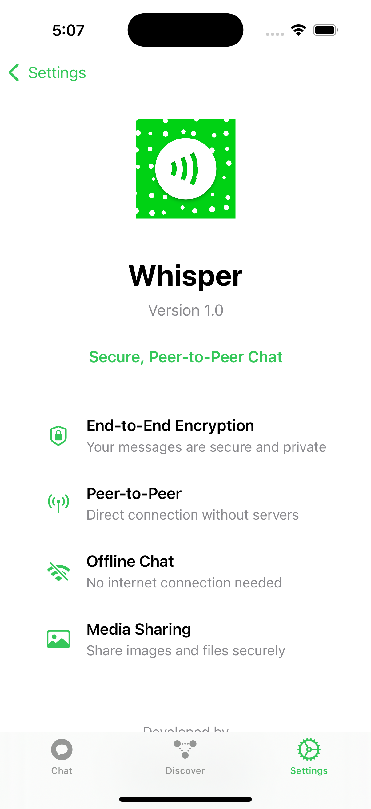

# 🤫 Whisper - Secure Peer-to-Peer Chat App

<p align="center">
  
</p>

Whisper is a privacy-focused, peer-to-peer chat application built with SwiftUI that enables secure communication between nearby devices using Apple's MultipeerConnectivity framework and ECC encryption.

## ✨ Features

- 📱 Peer-to-peer messaging without internet connectivity
- 🔒 End-to-end encryption using ECC
- 👥 Discover nearby users
- 📸 Share images and files
- 🌓 Dark/Light mode support
- 🔔 Real-time message notifications
- 👤 Customizable user profiles

## 🚀 Getting Started

### Prerequisites

- iOS 15.0+
- Xcode 13.0+
- Swift 5.5+

### Installation

1. Clone the repository
```bash
git clone https://github.com/ChillVeen/whisper.git
```

2. Open the project in Xcode
```bash
cd whisper
open Whisper.xcodeproj
```

3. Build and run the project

## 🔒 Security

Whisper uses:
- ECC (Elliptic Curve Cryptography) for end-to-end encryption
- Secure key exchange protocols
- Local data storage

## 🛠️ Technical Details

### Architecture
- SwiftUI for UI
- MVVM design pattern
- MultipeerConnectivity framework for P2P communication
- Combine framework for reactive programming

### Key Components
- `MCManager`: Handles peer-to-peer connectivity
- `ECCEncryption`: Manages encryption/decryption
- `ChatView`: Main messaging interface
- `ProfileView`: User profile management

## 📱 Screenshots

<p align="center">
  
  
  
  
  
 
</p>

## 🤝 Contributing

1. Fork the repository
2. Create your feature branch (`git checkout -b feature/AmazingFeature`)
3. Commit your changes (`git commit -m 'Add some AmazingFeature'`)
4. Push to the branch (`git push origin feature/AmazingFeature`)
5. Open a Pull Request

## 📄 License

This project is licensed under the MIT License - see the [LICENSE](LICENSE) file for details

## 👏 Acknowledgments

- [Apple's MultipeerConnectivity Framework](https://developer.apple.com/documentation/multipeerconnectivity)
- [SwiftUI](https://developer.apple.com/xcode/swiftui/)
- [Security Framework](https://developer.apple.com/documentation/security)

---

<p align="center">
  Made with ❤️ by Praveen
</p>\
